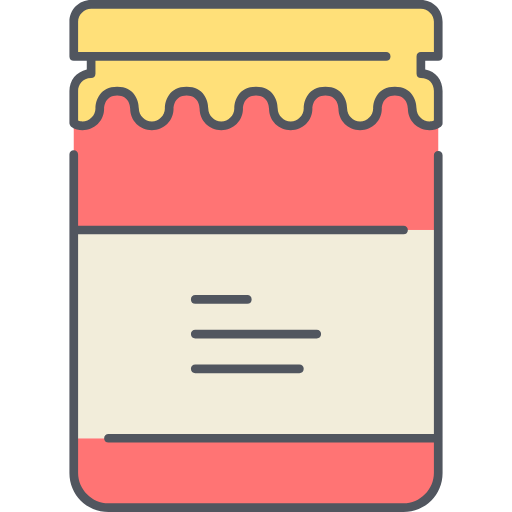

<div class="container">
  <div class="row">
    <div class="col-sm">
        
    </div>
    <div class="col">
      <h1 align="justify">
        Model Jar
      </h1>
    </div>
  </div>
</div>

An AI model jar that __just works__! Don't repeat code for loading models. And download directly from the cloud provider of your choice. All you need is a `model_jar.py` file in your model folder. Here's a sample folder structure for your saved model. Zip it (optional) and upload it to your jar.

```
[+] some_very_fancy_model_name
    - details.yaml      # Optional, but recommeded
    - model_jar.py      # Required
    - checkpoint_x.pt
    - checkpoint_y.pt
    - ...               # Add all the checkpoints you want
    - model_a_defn.py
    - model_b_defn.py
    - ...               # More than one model is possible
```

### What do you need to write in `model_jar.py`?
You only need to expose the model classes and their init parameters. The parameters should be named as `default_attributes`. Below is a sample 

```
from model_a_defn import ModelA
from model_b_defn import ModelB

default_attributes = {
    'ModelA': {},
    'ModelB': {},
}
```

### Setup (manual installation)
```
pip install .
```

### Usage example 

```
from model_jar import download_model, load_from_dir

# Download model from azure storage and unzip
download_model(
    provide = 'azure',
    config  = {
        'name'           : '2023_03_23_wav2vec2_finetuned_ljspeech.zip',
        'account_url'    : 'account_url',
        'container_name' : 'azure-model-jar',
        'client_id'      : 'identity_id',
        'client_secret'  : 'identity_secret',
        'tenant_id'      : 'tenant_id',
    },
    dir_path = './models',
    unzip    = True
)

# Load model from dir
model = load_from_dir(
    name           : 'Wav2vec2',
    dir_path       : './models/2023_03_23_wav2vec2_finetuned_ljspeech',
    checkpoint     : 'checkpoint_100.pt',
    checkpoint_key : 'wav2vec2_state_dict'
)
```
